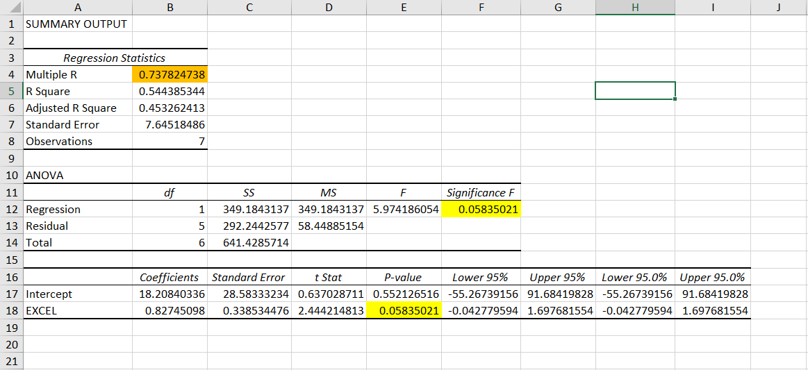
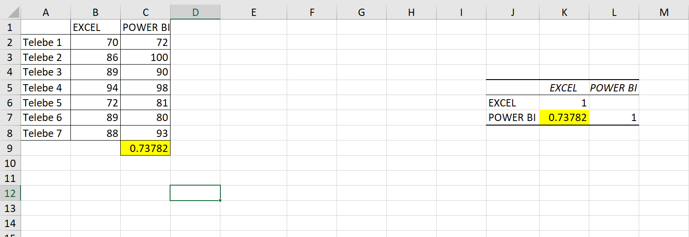

# 📊 Regression & Correlation Analysis - Excel File

This Excel file contains regression and correlation analysis based on a dataset comparing **Excel scores** with **Power BI scores**. The analysis includes regression statistics, ANOVA, and correlation coefficients to understand the relationship between these two variables.

---

## 📁 Overview

The analysis involves the following key sections:

1. **Regression Output**: Presents regression statistics and ANOVA for evaluating the relationship between the Excel and Power BI scores.
2. **Correlation Coefficient**: Calculates the strength and direction of the relationship between the two variables.

---

## 🔑 Key Outputs

### 1. **Regression Statistics**

In the "Regression Statistics" section, we have the following values:

- **Multiple R**: 0.737824738  
  Indicates a **strong positive correlation** between Excel and Power BI scores.
  
- **R Square**: 0.544385344  
  The proportion of the variance in Power BI scores that can be explained by the Excel scores (54.44%).

- **Adjusted R Square**: 0.453262413  
  Adjusted for the number of predictors in the model, indicating that 45.33% of the variance in Power BI scores can be predicted by Excel scores.

- **Standard Error**: 7.64518486  
  Shows the typical error margin for predictions made by the regression model.

- **Observations**: 7  
  The number of data points (students) used for the regression analysis.

### 2. **ANOVA (Analysis of Variance)**

The ANOVA table shows:

- **Regression df (degrees of freedom)**: 1  
  Number of predictors in the regression model.
  
- **Residual df**: 5  
  Number of residuals (errors).

- **F-statistic**: 5.974186054  
  The ratio used to determine how well the model fits the data.

- **Significance F**: 0.05835021  
  The p-value, which suggests the model's statistical significance. A p-value less than 0.05 is typically considered statistically significant, but here it is just above that threshold.

### 3. **Coefficients**

- **Intercept**: 18.20840336  
  The predicted value of Power BI when the Excel score is zero.

- **Excel Coefficient**: 0.82745098  
  This is the slope, indicating that for every unit increase in Excel score, the Power BI score increases by approximately 0.83.

- **P-value**: 0.05835021  
  The p-value for the Excel coefficient suggests that the relationship between Excel and Power BI scores is not statistically significant at the 95% confidence level.

- **Confidence Interval**:  
  The range within which the true coefficient value is likely to fall. The interval is between **-55.27** and **91.68** for the intercept and **-0.0428** and **1.6977** for the Excel coefficient.

### 4. **Correlation Coefficient**

In the "Correlation" section, the **Pearson correlation coefficient** between Excel and Power BI scores is calculated:

- **Pearson Correlation Coefficient**: 0.73782  
  Indicates a **strong positive correlation** between Excel and Power BI scores, suggesting that higher Excel scores tend to correlate with higher Power BI scores.

---

## 🧑‍💻 Technologies Used

- **Microsoft Excel** for regression and correlation analysis
- **Data Analysis Toolpak** for ANOVA and regression calculations
- **Excel Functions** for calculating correlation coefficient

---

## 🚀 Use Cases

- **Educational Performance Analysis**: Understanding the relationship between students' performance in Excel and Power BI.
- **Predictive Analytics**: Using regression analysis to predict future Power BI scores based on Excel performance.
- **Decision Making**: Help instructors or decision-makers understand if improving one tool's score (Excel) leads to improvement in another tool's score (Power BI).

---

## 🧠 Future Improvements

- Expand the dataset to include more observations for better accuracy.
- Add additional variables to improve the regression model (e.g., student experience or study hours).
- Use more advanced regression models, such as **multiple regression**, to predict Power BI scores based on multiple independent variables.

---

## 📷 Screenshots of Key Analysis

### 1. **Regression Output**

### 2. **Correlation Output**

> *Ensure to place the images in the correct path for them to display.*

---

## 🧑‍💼 Author

- **[Your Name]**  
Excel Analyst | Data Scientist | Data Analyst

---

